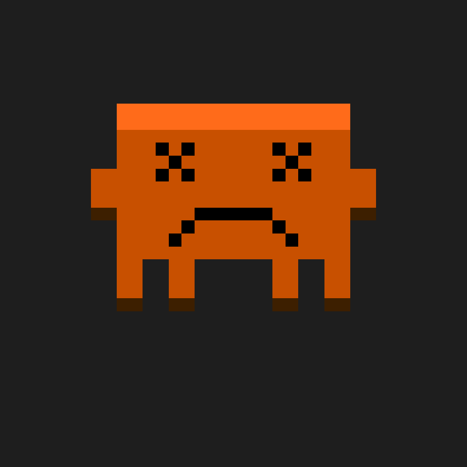

Claude Code works out of sight. It reads a file, edits another, runs a command,
and the only way to follow along is to watch a column of text scroll past.
Claude Crab replaces that with a glance: a pixel crab in a VS Code panel that
holds a different pose depending on what the assistant is doing right now.


## Ten poses

The crab has ten states, and each one is a pose you can read from the corner of
your eye without stopping what you are doing.

| What the assistant did | What the crab does |
| --- | --- |
| Nothing, waiting | Bobs |
| Received a prompt | Builds a thought bubble in three stages |
| Read a file | Looks down at a page |
| Wrote a file | A yellow pencil sweeps across that page |
| Ran a shell command | Turns to a beige Mac-ish terminal, green text typing |
| Finished, sounding pleased | Grins, sparkles, green tick |
| Finished, sounding stuck | Crossed eyes and a frown |
| Finished, sounding unsure | Shrugs |
| Changed its mind | Raised claw and an exclamation mark |
| Compacted the context | Jumps on a cardboard box until it is flat |

Four of those are temporary and revert on a timer — the error face holds for
240 frames, success for 180 — because a grin that stays forever stops meaning
anything.

The crossed eyes are lifted from the losing face in Minesweeper. The box
jumping is a joke about what compaction actually is.

## The bridge is one line of curl

Claude Code will run a command of your choice when something happens: a session
starts, a tool is about to run, a tool has finished, the assistant has stopped,
the context is about to be compacted. Seven of those events are wired up here,
and each one is the same command:

```bash
curl -s -X POST http://localhost:57438 -H "Content-Type: application/json" -d @-
```

The hook's JSON arrives on stdin and goes straight to a small HTTP server
inside the extension. That is the entire bridge. Nothing leaves the machine,
there is no protocol to version, and the port is hardcoded precisely so that
`~/.claude/settings.json` can point at a stable URL.

The extension writes those hook entries for you the first time it runs, and the
write is idempotent in a slightly blunt way: before adding its own entries it
strips every hook whose command mentions `localhost:57438`. Re-running it can
therefore never leave you with two crabs listening to the same session.

Only the `Stop` event needs interpretation, because "the assistant has finished"
does not say whether it went well. So the last message gets skimmed for words —
*done*, *failed*, *not sure*, *hold on* — and the order those patterns are
tried in is load-bearing: a message containing both "actually" and "error" is a
change of mind, not a failure.

## Nothing here is an image file

There are no sprites and no PNGs in the running extension. Every frame is a
`Uint8Array` of 1296 palette indices — a 36 by 36 grid — assembled by calling
drawing functions: a body, a left arm, a raised right arm, legs, one of eight
eye styles, one of six mouths, and whichever prop the pose needs. An animation
is a list of those grids with a duration each, so the bobbing idle, the typing
terminal and the building thought bubble all run through one mechanism.

Three of the palette's twenty-three slots are not fixed colours. They are read
out of the active VS Code theme at load — the paper the crab reads from, the
code lines on it, the crab's own eyes — so the pose sits in whatever editor you
are already using rather than next to it.

Durations are counted in animation frames rather than milliseconds, which
started as a convenience and turned out to matter: the loop only repaints when
the frame index changes, so the error pose, which is a single frame held for
600 ticks, costs exactly one draw and then nothing at all for ten seconds.



## Thirty-six pixels is the constraint, not the limitation

At 36 pixels across there is no room for detail, which is the point — every
pose has to survive being squinted at, because squinting at it is the only way
it will ever be looked at. That rules out expressions and leaves silhouettes:
head down, arm up, facing away.

Getting there needed tooling. A developer mode overlays the canvas with a 36 by
36 grid and prints the pixel coordinate under the cursor, so a misplaced claw is
a number to fix rather than a hunt. The extension icon is generated from the
first idle frame by a script that writes the PNG by hand — CRC table, `IHDR`,
`IDAT`, `IEND`, one filter byte per row — rather than adding an image library
to a project whose whole premise is not having one.

## Parked at 0.4.0

It works, end to end, and it has been packaged as an installable `.vsix`, but
it was never published to the Marketplace and the last `.vsix` on disk is two
versions behind the code. Nothing has been touched since May.

The README has drifted from what is actually there. It documents nine states
and there are ten — the box-jumping compaction animation arrived without a
mention. It tells you to run a "Set up hooks" command that is no longer in the
command palette, because the extension now offers to write the hooks itself. It
also says the crab appears automatically, which it does not: the extension
declares no activation events, so nothing starts until you run one of its three
commands.
